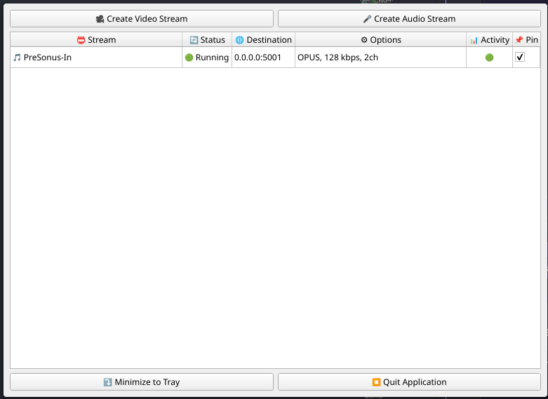

# ⚠️ **AI ALERT**

As a software engineer with limited C++ expertise, I directed the development of Qt‑Caster by iteratively prompting AI language models (Claude and DeepSeek) to generate the majority of the code. Through systematic debugging, precise requirements, and continuous validation of the AI's output, I guided the project from concept to a fully functional streaming application. This process demonstrates my ability to leverage AI tools effectively while retaining full ownership of problem‑solving and architectural decisions.

# 🎬 Qt-Caster Stream Manager

**Qt-Caster** is a cross-platform GUI application for streaming your screen (video) and microphone/audio input (audio) over UDP using **GStreamer** and **PipeWire** (Linux) / platform‑specific capture APIs. It supports **custom stream names**, **hardware acceleration** (VAAPI, NVENC, QSV), **software fallback**, and **persistent pinned streams** that automatically start on launch.

[](https://www.gnu.org/licenses/gpl-3.0)
[](https://github.com/yourusername/qt-caster)

---

## 📸 Screenshots

### Main screen



### Video stream creation


### Audio stream creation


## ✨ Features

- **🎥 Video Streaming** – Capture any screen/window via PipeWire (Linux) with configurable:
  - Resolution, bitrate, framerate (via encoder)
  - Encoder: `x264` (software), `VAAPI H.264`, `NVENC H.264`, `QSV H.264`
  - Hardware acceleration with automatic fallback to software
  - x264 tuning (`zerolatency`, `film`, …), speed presets, profile
- **🎤 Audio Streaming** – Capture any PipeWire audio source (mic, loopback) with:
  - Codec: `Opus` or `AAC`
  - Bitrate, channels (1–8), sample rate
  - Opus application (`audio`, `voip`, `lowdelay`)
- **📛 Custom Stream Names** – Give your streams human‑readable names; otherwise auto‑named (`qt-caster-video-1`, …)
- **📌 Pin & Save Streams** – Check the **Pin** column to save a stream permanently. Pinned streams are saved to `~/.config/qt-caster/saved-streams.json` and restart automatically when the app launches.
- **✏️ Edit Running Streams** – Right‑click any active stream to modify its configuration (video or audio) and restart it with the new settings.
- **👁️ Video Preview** – For video streams, right‑click and select “Visualize Stream” to open a separate window showing the captured video (uses the same PipeWire source).
- **🎚️ Virtual Sink (Audio)** – When creating an audio stream, check “Create virtual sink” to create a PulseAudio null sink and automatically route the stream through it. This makes the audio available to other applications for further processing.
- **🖥️ Live Stream Table** – View all active streams with status, destination, options, and live activity indicator (🟢/🔴)
- **🖱️ System Tray Integration** – Minimize to tray, right‑click to manage streams, click to show window
- **🧹 Clean Shutdown** – Gracefully terminates all GStreamer processes on quit (Ctrl+C, tray quit, window close)
- **📦 Portable AppImage (Linux)** – Single‑file executable with **zero runtime dependencies** (bundles Qt, GStreamer, all plugins)

---

## 🖥️ Supported Platforms

| Platform           | Status             | Notes                                           |
| ------------------ | ------------------ | ----------------------------------------------- |
| **Linux** (x86_64) | ✅ Fully supported | PipeWire required; AppImage available           |
| **macOS**          | 🚧 In progress     | Requires GStreamer, CoreAudio, ScreenCaptureKit |
| **Windows**        | 🚧 Planned         | DirectShow / WGC, DirectSound                   |

---

## 🔧 Requirements (for developers)

### Linux

- **Qt6** (`Core`, `Widgets`, `Multimedia`)
- **GStreamer** 1.0+ with plugins:
  - `gst-plugins-base`
  - `gst-plugins-good` (for `pipewiresrc`, `udpsink`)
  - `gst-plugins-bad` (for `vaapih264enc`, `nvh264enc`, `qsvh264enc` – optional)
  - `gst-plugins-ugly` (for `x264enc`)
  - `gst-libav` (for `avenc_aac`)
- **PipeWire** (≥ 0.3.40) with development headers
- **CMake** ≥ 3.16
- **C++17** compiler

**Install on Arch Linux:**

```bash
sudo pacman -S qt6-base qt6-multimedia gstreamer gst-plugins-base gst-plugins-good gst-plugins-bad gst-plugins-ugly gst-libav pipewire cmake base-devel
```

**Install on Ubuntu/Debian:**

```bash
sudo apt install qt6-base-dev qt6-multimedia-dev libgstreamer1.0-dev libgstreamer-plugins-base1.0-dev \
  gstreamer1.0-plugins-good gstreamer1.0-plugins-bad gstreamer1.0-plugins-ugly gstreamer1.0-libav \
  libpipewire-0.3-dev cmake build-essential
```

**Install on Fedora:**

```bash
sudo dnf install qt6-qtbase-devel qt6-qtmultimedia-devel gstreamer1-devel gstreamer1-plugins-base-devel \
  gstreamer1-plugins-good gstreamer1-plugins-bad-free gstreamer1-plugins-ugly-free \
  gstreamer1-libav pipewire-devel cmake gcc-c++
```

### macOS

- Qt6 (via Homebrew or official installer)
- GStreamer (from gstreamer.freedesktop.org)
- CMake

### Windows

- Qt6 (MSVC 2019/2022)
- GStreamer (MinGW or MSVC runtime)
- CMake

## 🛠️ Build from Source

### 1. Clone the repository

```bash
git clone https://github.com/Khyretos/qt-screen-caster.git
cd qt-screen-caster
```

### 2. Configure with CMake

```bash
mkdir build && cd build
cmake .. -DCMAKE_BUILD_TYPE=Release
```

### 3. Build

#### Cmake

```bash
git clone https://github.com/Khyretos/qt-screen-caster.git
cd qt-screen-caster
mkdir build && cd build
cmake .. -DCMAKE_BUILD_TYPE=Release
make -j$(nproc)
```

#### Ninja

```bash
git clone https://github.com/Khyretos/qt-screen-caster.git
cd qt-screen-caster
rm -rf build
mkdir build && cd build
cmake -DCMAKE_BUILD_TYPE=Debug \
      -DCMAKE_C_COMPILER=/usr/bin/clang \
      -DCMAKE_CXX_COMPILER=/usr/bin/clang++ \
      -G Ninja ..
ninja
```

After successful build, you will have two executables in the build/ directory:

`qt-caster` – Main GUI application

`qt-caster-worker` – Worker process (spawned by the GUI)

## 📦 Packaging – Create a Portable AppImage (Linux)

Qt-Caster can be bundled into a single, dependency‑free AppImage using a Docker‑based build process. This ensures the environment is consistent and reproducible.

### 1. Install Docker (if not already installed)

Follow the official instructions for your distribution: [https://docs.docker.com/engine/install/](https://docs.docker.com/engine/install/). Make sure the Docker daemon is running.

### 2. Build the AppImage

The repository includes a `Dockerfile.appimage` and a `build-appimage.sh` script. Simply run:

```bash
./build-appimage.sh
```

The script builds the Docker image, compiles the application inside, and creates the AppImage. Once finished, the AppImage will be located in the dist/ folder inside the project root.

**Note:** The AppImage bundles **everything** – Qt, GStreamer, and all required plugins. It runs on any modern Linux distribution **without** needing to install GStreamer or Qt separately. The first build may take a few minutes as it downloads the base image and dependencies. Subsequent builds will be faster due to Docker caching.

## 🚀 Usage

### Starting the Application

```bash
./qt-caster # from build directory
./Qt-Caster-x86_64.AppImage # portable version
```

### Creating a Stream

1. Click 🎥 **Create Video Stream** or 🎤 **Create Audio Stream.**

2. Configure the stream parameters:

   - **Video:** resolution, bitrate, encoder (hardware/software), tuning options.

   - **Audio:** codec (Opus/AAC), bitrate, channels, sample rate, direction (outgoing/incoming).

3. (Optional) Enter a **custom name** – otherwise an auto‑name is assigned (e.g., `qt-caster-video-1`).

4. For audio streams, you can optionally enable **Create virtual sink** and provide a custom sink name. This creates a PulseAudio null sink and automatically routes the stream through it, making the audio available to other applications.

5. Click ✅ **Start.**

6. If streaming a screen, the PipeWire portal will appear – select a screen or window to capture.

### Managing Streams

The main window displays all active streams in a table. You can:

- **Double‑click** any row → stops and removes that stream.

- **Pin** a stream by checking the 📌 column → the configuration is saved to `~/.config/qt-caster/saved-streams.json` and the stream will automatically restart when the application launches.

- **Right‑click** a row to open a context menu with additional options:

  - ✏️ **Edit Stream** – modify the stream’s configuration (video or audio). The stream will be restarted with the new settings.

  - 👁️ **Visualize Stream** (video only) – opens a separate window showing the captured video (using the same PipeWire source). Useful to verify you are sharing the correct screen/window.

- **System Tray** – right‑click the tray icon for quick actions, or hover to see a list of active streams.

### Virtual Sink for Audio

When you enable “Create virtual sink” in the audio stream dialog, a PulseAudio null sink is created (e.g., `qt-caster-stream-name`). The audio stream is connected to that sink:

For **outgoing** streams, the source is the sink’s monitor (i.e., the virtual sink acts as an input source for other applications).

For **incoming** streams, the sink is used as the playback device, allowing you to capture the received audio separately.

You can manage the sink with standard PulseAudio tools (`pactl list sinks`, `pavucontrol`). The sink is automatically removed when the stream stops.

### Stopping the Application

- Click ⏹ **Quit Application** – all streams are terminated gracefully.
- Press **Ctrl+C** in the terminal – same clean shutdown.
- Click the window close button (X) – minimizes to tray (unless quitting).

## 📁 Configuration & Saved Streams

Pinned streams are stored in:

- Linux: `~/.config/qt-caster/saved-streams.json`

The file is plain JSON. You can edit it manually, but it’s easier to use the Pin checkbox in the UI.

## 🐛 Troubleshooting

| Problem                                                           | Solution                                                                                                                                          |
| ----------------------------------------------------------------- | ------------------------------------------------------------------------------------------------------------------------------------------------- |
| **Video stream fails with “stream error: no more input formats”** | Ensure `stream-properties` is not in the video pipeline (it is removed in the working version). Use the pipeline provided in `stream_worker.cpp`. |
| **Hardware encoder not available**                                | Install system drivers (VAAPI, NVIDIA, Intel QSV). The app automatically falls back to `x264`.                                                    |
| **AppImage doesn’t start**                                        | Ensure it’s executable (`chmod +x`). If on an older distribution, try building with an older GLIBC.                                               |
| **No system tray icon**                                           | Some desktop environments (e.g., GNOME) do not support system trays. The app still works; use the window directly.                                |
| **PipeWire portal does not appear**                               | Install `xdg-desktop-portal` and `xdg-desktop-portal-gtk` (or `-kde`). Restart session.                                                           |

## 🤝 Contributing

Contributions are welcome! Please follow these steps:

1. Fork the repository.
2. Create a feature branch (git checkout -b feature/amazing-feature).
3. Commit your changes (git commit -m 'Add amazing feature').
4. Push to the branch (git push origin feature/amazing-feature).
5. Open a Pull Request.

### Coding style

- Use 4 spaces for indentation.
- Follow Qt naming conventions (camelCase for methods, PascalCase for classes).
- Include emoji log messages (see existing code) for clarity.

## 📄 License

This project is licensed under the GNU General Public License v3.0 – see the [LICENSE](./LICENSE) file for details.

## 🙏 Acknowledgments

- [GStreamer](https://gstreamer.freedesktop.org/) – multimedia framework
- [Qt Project](https://www.qt.io/) – cross‑platform GUI toolkit
- [PipeWire](https://pipewire.org/) – low‑latency audio/video server
- [linuxdeploy](https://github.com/linuxdeploy) – AppImage packaging tools
